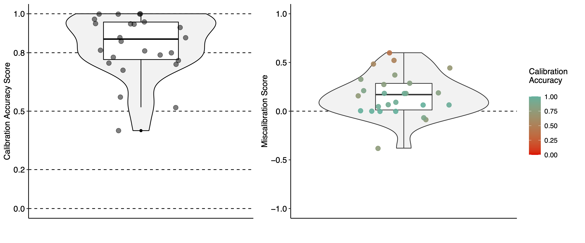

# **mcc**
#### An R-package for **M**eta**C**ognitive **C**alibration analysis and visualization
<hr>

[](http://creativecommons.org/licenses/by-nc-sa/4.0/)


## Introduction
<hr>

The **`mcc`** package allows calculating and visualizing metacognitive performance judgement data. For a theoretical elaboration of the methodological approach and for the results from an empirical application, please read the following paper: 

**Tobler, S. & Kapur, M. (2023). Metacognitive calibration: a methodological expansion and empirical application. https://doi.org/10.3929/ethz-b-000600979**

In this paper, the following functions are described: 

- Overconfidence 
- Underconfidence
- Calibration accuracy
- Miscalibration

These functions can be applied on performance-judgement-based on 4-point Likert scale data (yes / rather yes / rather no / no) or on performance-judgement-based on binary data (yes / no). 

Additionally, commonly used functions in the literature for calibration accuracy are available as well. These correspond to: 

- _d'_
- _gamma_
- _G_-index

#### Preparation of the data

To use the functions, the data need to be prepared. Therefore, the functions require 

1.  a data frame with the performance data (participants x questions), in which questions are rated 1 if correct and 0 if incorrect
2.  a data frame with the performance-judgement values, either numerically designated (e.g., 0-3) or alphabetical with the already correctly assigned letters (see Table 1 in the paper). 

The assigned letters in the data preparation correspond to those depicted in Table 1 of the paper mentioned above. A step-by-step instruction in R is shown below. 

## Package contents
<hr>

#### Data Preparation

Ideally, the performance-judgement is assessed by using a 4-point Likert scale. In case the performance judgement has been assessed on a binary scale, you need to first transform them by using the `btof`-function. This function only works if the confidence judgements are already transformed to the letters _a_ to _d_. 

-   `btof`: To transform the **binary** judgement data that they can be used in the various functions. This step is necessary for all functions described in here beside _d'_, _gamma_, or _G_-index.

In case the judgement data is assessed on a 4-point Likert scale and the values are numerical, step 1 and 2 have to be performed. If the values are already transformed to letters according to table 1 in the paper, step 1 can be skipped. 

**Step 1**: Transforming Likert data to letters a-h

-   `letterassignment`: requires the input of performance and judgement data

**Step 2**: Count different letters per participant

-   `participant_summary`: requires either the results from Step 1 or the letter-based data. If binary data is assessed, use first the `btof`-function and then proceed here. 

In case you need to use the functions _d'_, _gamma_, or _G_-index, but you collected the data on a 4-point scale, you can transform them to binary values using this function: 

- `binarization`: to transform 4-level to 2-level data

<br>

#### Main functions

To analyze overconfidence, underconfidence, calibration accuracy, and miscalibration, the following functions can be used: 

-   `overconfidence`: requires a data with the counted letters per participant (i.e., the result from the `participant_summary`-function)
-   `underconfidence`: requires a data with the counted letters per participant (i.e., the result from the `participant_summary`-function)
-   `calibrationaccuracy`: requires a data with the counted letters per participant (i.e., the result from the `participant_summary`-function)
-   `miscalibration`: requires a data with the counted letters per participant (i.e., the result from the `participant_summary`-function)

Alternatively, one can directly use the function `conf.stats` to skip all these steps and directly get the summary. This function works only when the judgement data has been assessed on a 4-point Likert scale. 

-   `conf.stats`: requires performance values (0 / 1), and judgement values (on a numerical scale)

<br>

#### Visualization

To visualize the findings, one can either look at the confidence accuracy ratings and the miscalibration individually, or directly visualize both in one plot. The functions to do so are. 

- `confidence_plot`: requires the calibration accuracy values
- `miscalibration_plot`: requires the miscalibration values
- `combined_plot`: requires both, calibration and miscalibration values 

<br>



#### Additional functions (common accuracy statistics)
-   `d_apostrophe`: to calculate _d'_-values
-   `gamma`: to calculate _gamma_-values
-   `g_index`: to calculate _G_-index-values

<br>

#### Auxiliary scripts
Some auxiliary scripts and functions are added to allow faster processing. These include: 

-   `colors.R`: for a set of predefined colors
-   `letters.R`: a vector of the letters in the performance-judgement matrix


## Installation
<hr>

``` r
library(devtools)
devtools::install_github("samueltobler/mcc", force = TRUE)
library(mcc)
```

## Citation
<hr>

To cite the **`mcc`**-package in publications, please use:

**Tobler, S. & Kapur, M. (2023). Metacognitive calibration: a methodological expansion and empirical application. Proceedings of the 17th International Conference of the Learning Sciences (ICLS 2023). Montréal, Canada. https://doi.org/10.3929/ethz-b-000600979**


<br>

## References
<hr>

Some of the functions require previously published R packages. These are the references of these packages (in alphabetical order). 

- Auguie B (2017). _gridExtra: Miscellaneous Functions for "Grid" Graphics_. R package version 2.3,   <https://CRAN.R-project.org/package=gridExtra>.
- Kassambara A (2020). _ggpubr: 'ggplot2' Based Publication Ready Plots_. R package version 0.4.0, <https://CRAN.R-project.org/package=ggpubr>.
- Neuwirth E (2022). _RColorBrewer: ColorBrewer Palettes_. R package version 1.1-3, <https://CRAN.R-project.org/package=RColorBrewer>.
- Wickham, H. (2016). _ggplot2: Elegant Graphics for Data Analysis_. Springer-Verlag New York.

<br>
